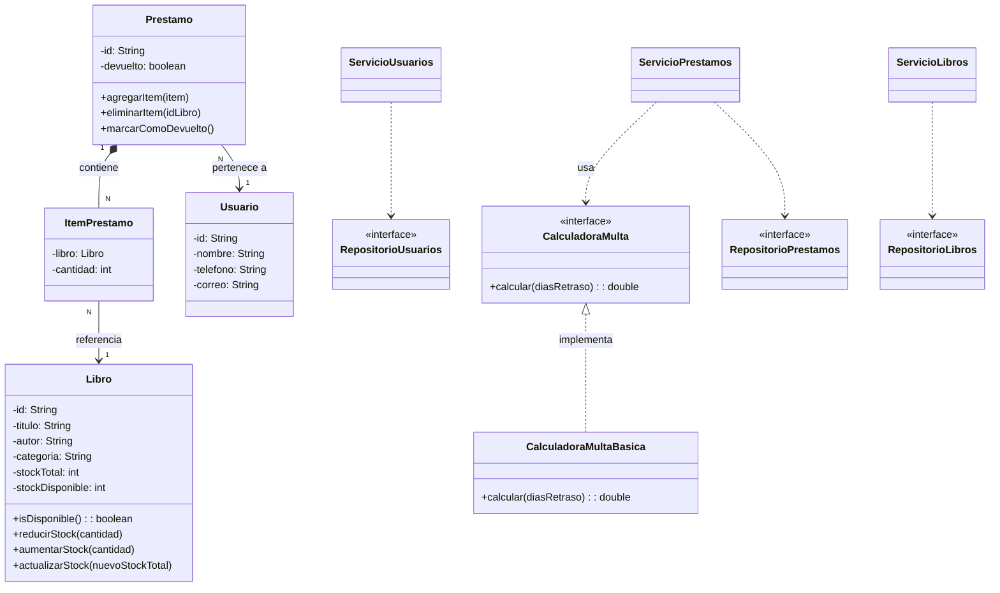

# BookTrack - Sistema de Gestión de Biblioteca Estudiantil

## Objetivo

Desarrollar una aplicación orientada a objetos que modele un sistema de gestión de biblioteca estudiantil, en respuesta a una necesidad real de mejora en la administración de recursos bibliográficos, aplicando principios SOLID y buenas prácticas de diseño.

---

## Contexto del problema

Se ha recibido una solicitud por parte de una biblioteca estudiantil perteneciente a una institución educativa, la cual requiere mejorar la forma en que administra sus libros, usuarios y préstamos.

Actualmente, el control se realiza de manera manual o mediante registros poco organizados, lo que genera diversas dificultades en la operación diaria.

Entre los principales problemas se encuentran:

- dificultad para conocer qué libros están disponibles;
- pérdida de tiempo en el registro de préstamos y devoluciones;
- errores al calcular multas por retraso;
- poca flexibilidad para adaptar el sistema a nuevas políticas.

Debido a estas limitaciones, se requiere desarrollar una solución tecnológica que sea escalable, mantenible y fácil de extender, permitiendo gestionar usuarios, libros, préstamos y reportes de manera clara y estructurada.

---

## Requerimientos funcionales

### 1. Usuarios
- Registrar usuarios con nombre, teléfono y correo
- Consultar usuarios registrados
- Editar usuarios
- Eliminar usuarios

### 2. Libros
- Registrar libros con título, autor, categoría y stock total
- Consultar libros registrados
- Editar libros
- Eliminar libros
- Controlar automáticamente la disponibilidad según el stock disponible
- Solo se pueden prestar libros con existencias disponibles

### 3. Préstamos
- Registrar préstamos de libros a usuarios
- Un préstamo puede contener uno o más libros
- Cada préstamo puede incluir varias copias de un mismo libro mediante cantidades
- Permitir agregar, quitar y actualizar cantidades de libros dentro de un préstamo antes de finalizarlo
- Permitir cancelar el proceso de creación del préstamo
- Registrar devoluciones
- Eliminar préstamos
- Un usuario puede tener múltiples préstamos
- Cambiar automáticamente la disponibilidad de cada libro al prestarlo, devolverlo o eliminar un préstamo no devuelto

### 4. Multas
- Calcular multa si uno o más libros se devuelven con retraso
- Permitir cambiar la forma de cálculo sin modificar el sistema
- En el futuro se podrán agregar nuevas políticas de multa

### 5. Reportes
- Cantidad de préstamos realizados
- Cantidad de títulos disponibles
- Cantidad de ejemplares disponibles
- Total de multas generadas

---

## Requerimientos técnicos

El sistema debe cumplir con:

- Uso de clases bien definidas
- Uso de encapsulación
- Uso de abstracción
- Uso de interfaces
- Uso de clases estáticas para utilidades
- Organización clara del código
- Aplicación de principios SOLID

---

## Estructura esperada del proyecto

```text
src/main/java/org/booktrack/
├── Main.java
├── interfaces/
│   ├── CalculadoraMulta.java
│   ├── RepositorioLibros.java
│   ├── RepositorioPrestamos.java
│   └── RepositorioUsuarios.java
├── models/
│   ├── Usuario.java
│   ├── Libro.java
│   ├── Prestamo.java
│   └── ItemPrestamo.java
├── multas/
│   └── CalculadoraMultaBasica.java
├── repository/
│   ├── RepositorioUsuariosMemoria.java
│   ├── RepositorioLibrosMemoria.java
│   └── RepositorioPrestamosMemoria.java
├── services/
│   ├── ServicioUsuarios.java
│   ├── ServicioLibros.java
│   └── ServicioPrestamos.java
├── utils/
│   └── GeneradorId.java
└── views/
    └── MenuConsola.java
```

## Decisiones de diseño

- Uso de identificadores automáticos mediante GeneradorId
- Almacenamiento en memoria (sin base de datos)
- Interfaz de usuario mediante consola
- Separación clara de responsabilidades en capas
- Uso de interfaces para desacoplar el sistema
- Cálculo de multas desacoplado mediante interfaz
- Uso de ItemPrestamo para modelar la relación entre préstamos y libros, incluyendo la cantidad de ejemplares por título
- Manejo de inventario mediante stock total y stock disponible

## Reglas de implementación

- No incluir lógica de negocio en las clases modelo
- Los servicios manejan la lógica del sistema
- Los repositorios gestionan almacenamiento
- El menú interactúa únicamente con los servicios
- El cálculo de multas se implementa mediante una interfaz
- La disponibilidad de los libros debe actualizarse automáticamente según el stock
- No se puede prestar una cantidad mayor al stock disponible
- No se puede modificar un préstamo ya devuelto
- Un préstamo debe contener al menos un ítem para poder finalizarse
- Al devolver o eliminar un préstamo no devuelto, el stock se repone automáticamente
- El stock total no puede quedar por debajo de los ejemplares actualmente prestados

## Aplicación de SOLID

### Single Responsibility Principle

Cada clase tiene una única responsabilidad:

- Usuario, Libro, Prestamo, ItemPrestamo representan entidades del dominio
- ServicioPrestamos gestiona la lógica del sistema
- CalculadoraMulta gestiona el cálculo de multas

### Open/Closed Principle

El sistema permite agregar nuevas formas de cálculo de multas sin modificar la lógica existente.

### Liskov Substitution Principle

Cualquier implementación de CalculadoraMulta puede sustituir a otra sin afectar el comportamiento del sistema.

### Interface Segregation Principle

Las interfaces están separadas según su responsabilidad:

- repositorios
- cálculo de multas

### Dependency Inversion Principle

Los servicios dependen de abstracciones y no de implementaciones concretas.

## Diagrama UML



## Ejecución local

### Requisitos

JDK 17 o superior.

### Compilar

```bash
mkdir -p out
javac -d out $(find src/main/java -name "*.java")
```

### Ejecutar

```bash
java -cp out org.booktrack.Main
```

### Notas

- Persistencia actual: en memoria (sin base de datos)
- IDs generados automáticamente con GeneradorId
- Interfaz mediante menú por consola
